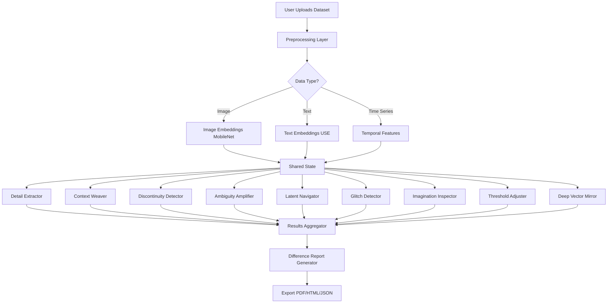

# The Difference Suite: Integrated Platform for Critical AI Analysis

## Vision

The **Difference Suite** is a unified meta-interface that integrates all Deep Culture "Little Tools of Difference" into a comprehensive platform for critically analyzing how AI systems process cultural data. Instead of using each tool in isolation, the Suite orchestrates them into a **multi-dimensional critique workflow** that surfaces ambiguity, contingency, and difference from every angle.

---

## Core Concept

**One Dataset → Complete Critical Analysis**

A user uploads a single dataset (images, text, or time-series). The Suite automatically:
1. **Extracts** marginal details that don't fit patterns
2. **Weaves** contextual relationships across domains
3. **Detects** temporal discontinuities and ruptures
4. **Amplifies** ambiguities through noise injection
5. **Navigates** latent semantic spaces
6. **Detects** anomalies and glitches
7. **Inspects** generative boundaries
8. **Adjusts** decision thresholds to reveal doubt
9. **Mirrors** the fragility of vectorization
10. **Generates** a comprehensive "Difference Report"

The result: A holistic view of how deep learning transforms cultural data, revealing what it smooths away, what it cannot imagine, and where it is uncertain.

---

## Integrated Apps Matrix

### Implemented Apps (11)
| App | Type | Primary Function | Epistemic Translation |
|-----|------|------------------|----------------------|
| **Discontinuity Detector** | Time | Temporal ruptures & contingency | Discontinuity → Contingency |
| **Imagination Inspector** | Gen | Latent boundary probing | Generativity → Creativity |
| **Detail Extractor** | Text | Outlier narratives & clustering | Detail → Narrative |
| **Threshold Adjuster** | Decision | Uncertainty exposition | Probability → Doubt |
| **Context Weaver** | Text | Cross-corpus relationality | Relationality → Context |
| **Ambiguity Amplifier** | Image/Text | Confidence destruction via noise | Identity → Ambiguity |
| **Glitch Detector** | Image/Text | Anomaly detection as critique | Anomaly → Contingency |
| **Latent Space Navigator** | Image/Text | Visual/Semantic interpolation | Latent Space → In-Between |
| **Deep Vector Mirror** | Multi | Vector fragility visualization | Representation → Fragility |
| **The Noise Predictor** | Image | Residual visualization via autoencoder | Resolution → Noise |
| **Networked Narratives** | Text | Entity extraction & network visualization | Linearity → Relationality |

---

## Architecture

### 1. Unified Data Model

All apps operate on a common data structure:

```typescript
interface SuiteDataset {
  id: string;
  type: 'image' | 'text' | 'timeseries' | 'tabular';
  items: DataItem[];
  metadata: {
    source: string;
    created: Date;
    description: string;
  };
}

interface DataItem {
  id: string;
  content: string | ImageData | number[];
  timestamp?: Date;
  labels?: string[];
  embedding?: number[];  // Computed by Suite
}
```

### 2. Analysis Pipeline

```
┌──────────────────┐
│  Data Upload     │
│  (Image/Text/Time)│
└────────┬─────────┘
         │
         ▼
┌──────────────────┐
│  Preprocessing   │  ← Compute embeddings once
│  - Embeddings    │
│  - Clusters      │
│  - Timestamps    │
└────────┬─────────┘
         │
         ▼
┌──────────────────────────────────────┐
│  Parallel Analysis (All Tools)       │
├──────────────────────────────────────┤
│  1. Detail Extraction                │
│  2. Context Weaving                  │
│  3. Discontinuity Detection          │
│  4. Ambiguity Amplification          │
│  5. Latent Navigation                │
│  6. Glitch Detection                 │
│  7. Imagination Inspection           │
│  8. Threshold Adjustment             │
│  9. Deep Vector Mirror               │
└────────┬─────────────────────────────┘
         │
         ▼
┌──────────────────┐
│  Difference      │
│  Report          │
│  Generation      │
└──────────────────┘
```

### 3. Frontend Architecture

**Tech Stack:**
- **Framework**: React + TypeScript
- **State**: Zustand (lightweight, perfect for multi-tool state)
- **Routing**: React Router (for navigating between analyses)
- **Charts**: D3.js + Recharts
- **ML**: TensorFlow.js (client-side) + FastAPI backend (for heavy models)

**Component Structure:**
```
DifferenceSuite/
├── src/
│   ├── components/
│   │   ├── DataUploader.tsx
│   │   ├── AnalysisDashboard.tsx
│   │   ├── tools/
│   │   │   ├── DetailExtractor.tsx
│   │   │   ├── ContextWeaver.tsx
│   │   │   ├── AmbiguityAmplifier.tsx
│   │   │   ├── ... (one per tool)
│   │   └── DifferenceReport.tsx
│   ├── stores/
│   │   └── suiteStore.ts  ← Shared state
│   ├── utils/
│   │   ├── embeddings.ts
│   │   ├── clustering.ts
│   │   └── reportGen.ts
│   └── App.tsx
```

---

## User Workflow

### Step 1: Upload & Configure
1. User lands on **Dashboard**
2. Uploads dataset (drag-and-drop or paste)
3. Selects data type (auto-detected)
4. Adds metadata (name, description, archive source)

### Step 2: Automatic Analysis
Suite runs all applicable tools in parallel:
- **Universal**: Deep Vector Mirror (visualizes the raw vectors)
- **For images**: Ambiguity Amplifier, Latent Navigator, Glitch Detector
- **For text**: Detail Extractor, Context Weaver, Text versions of above
- **For time-series**: Discontinuity Detector
- **For decisions**: Threshold Adjuster
- **For generative**: Imagination Inspector

Progress bar shows: "Analyzing with 9 tools..."

### Step 3: Explore Results
**Dashboard View** shows overview:
- **Detail**: 12 outliers found
- **Context**: Analyzed across 3 corpora
- **Discontinuity**: 5 temporal ruptures detected
- **Ambiguity**: Average confidence drop: 45% at 70% noise
- **Latent**: 18 semantic "in-between" concepts
- **Glitch**: 23 anomalies (3.2% of dataset)
- **Imagination**: 14 impossible prompts identified
- **Threshold**: 67 cases "in doubt" at 0.7 threshold
- **Vector Mirror**: High fragility detected in 15% of vectors

User clicks on any metric to dive into that tool's detailed view.

### Step 4: Generate Report
Clicks **"Generate Difference Report"**

Suite compiles:
1. **Executive Summary**: Key findings from all tools
2. **Detail Analysis**: Individual outlier stories
3. **Relational Map**: Cross-corpus context graph
4. **Timeline**: Discontinuities highlighted
5. **Ambiguity Zones**: Where AI is least certain
6. **Latent Spaces**: Semantic in-betweens
7. **Anomaly Catalog**: Glitches and outliers
8. **Generative Limits**: What AI cannot create
9. **Threshold Effects**: Who's affected by threshold changes
10. **Vector Fragility**: Analysis of representation stability
11. **Recommendations**: Critical interventions suggested

Report is exportable as:
- **PDF** (for sharing)
- **HTML** (interactive)
- **JSON** (for further analysis)

---

## Integration Patterns

### Pattern 1: Shared Embeddings
- All tools that need embeddings (Detail Extractor, Context Weaver, Latent Navigator, Vector Mirror) use the **same pre-computed embeddings**
- Computed once on upload, stored in Suite state
- Models: USE (text), CLIP/MobileNet (images)

### Pattern 2: Progressive Enhancement
- **Light analysis** runs client-side (TensorFlow.js)
- **Heavy analysis** (generative models, large language models) calls backend API
- User sees incremental results as they complete

### Pattern 3: Cross-Tool Insights
Tools can **reference each other's findings**:
- Detail Extractor flags outliers → Context Weaver explains why (they're contextually distant)
- Discontinuity Detector finds temporal break → Ambiguity Amplifier shows confidence dropped then
- Threshold Adjuster identifies "in doubt" cases → Detail Extractor generates narratives for them
- Deep Vector Mirror visualizes the *cause* of errors found by Ambiguity Amplifier

### Pattern 4: Modular Activation
Users can **disable tools** they don't need:
- Checkbox list on upload: "Which analyses to run?"
- Default: All applicable tools
- Advanced users: Select specific combinations

---

## Technical Implementation Plan

### Phase 1: Foundation (Month 1-2)
- [ ] Create Suite shell (React app)
- [ ] Implement data upload + preprocessing
- [ ] Build shared embedding pipeline
- [ ] Integrate core existing apps (Ambiguity, Latent, Glitch)

### Phase 2: Tool Integration (Month 3-4)
- [ ] Integrate Detail Extractor & Context Weaver
- [ ] Integrate Deep Vector Mirror
- [ ] Build dashboard overview

### Phase 3: Advanced Tools (Month 5-6)
- [ ] Integrate Discontinuity Detector
- [ ] Integrate Threshold Adjuster
- [ ] Add cross-tool intelligence

### Phase 4: Generative & Reporting (Month 7-8)
- [ ] Integrate Imagination Inspector (requires backend)
- [ ] Build Difference Report generator
- [ ] Add export functionality (PDF/HTML/JSON)

### Phase 5: Polish & Deploy (Month 9)
- [ ] UI/UX refinement
- [ ] Performance optimization
- [ ] Deploy to cloud (Vercel + Cloud Run)
- [ ] Documentation & tutorials

---

## Data Flow Diagram



---

## UI/UX Design

### Dashboard Layout
```
┌─────────────────────────────────────────────────────┐
│  🔷 Difference Suite                     [User Menu]│
├─────────────────────────────────────────────────────┤
│                                                      │
│  📁 Dataset: "Holocaust Deportation Records"       │
│  📊 Type: Text (1,247 documents)                    │
│  📅 Uploaded: 2025-11-29                           │
│                                                      │
├──────────────┬──────────────┬──────────────┬────────┤
│  Detail      │  Context     │  Discontinuity│ More ▼│
│  12 outliers │  3 corpora   │  5 ruptures   │       │
├──────────────┴──────────────┴──────────────┴────────┤
│                                                      │
│  ┌─────────────  Active Analyses  ────────────┐    │
│  │                                              │    │
│  │  🔍 Detail Extractor                      ✓ │    │
│  │  🌐 Context Weaver                        ✓ │    │
│  │  📉 Discontinuity Detector                ✓ │    │
│  │  🎲 Ambiguity Amplifier                   ✓ │    │
│  │  🧭 Latent Navigator                      ✓ │    │
│  │  ⚡ Glitch Detector                       ✓ │    │
│  │  🎨 Imagination Inspector            [Skip]│    │
│  │  ⚖️ Threshold Adjuster                    ✓ │    │
│  │  🪞 Deep Vector Mirror                    ✓ │    │
│  │                                              │    │
│  │         [Generate Difference Report]         │    │
│  └──────────────────────────────────────────────┘    │
│                                                      │
└─────────────────────────────────────────────────────┘
```

---

## Conclusion

The **Difference Suite** transforms the "Little Tools of Difference" from isolated explorations into a **comprehensive critical infrastructure** for deep learning analysis. By integrating all tools into a unified workflow, it enables researchers, activists, and educators to:

- **Understand** how AI transforms their cultural data
- **Surface** what AI smooths away, cannot imagine, or is uncertain about
- **Contest** algorithmic decisions through threshold adjustment
- **Recover** marginal voices through detail extraction
- **Reimagine** cultural meanings through contextual weaving
- **Expose** the fragility of the underlying vector representations

It embodies the DEEP CULTURE project's mission: moving from "deep culture of uniformity" to "deep cultures of difference" where ambiguity, contingency, and difference are not bugs to be fixed, but **essential features of humanistic inquiry**.

The Suite is not just a research tool—it's a **public thing** that makes deep learning visible, contestable, and reimaginable for everyone.
